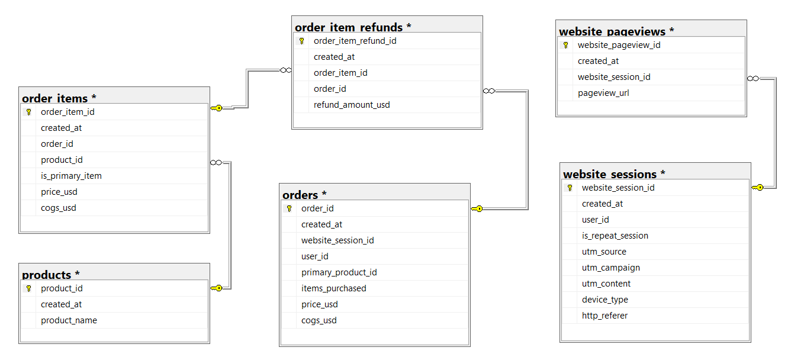
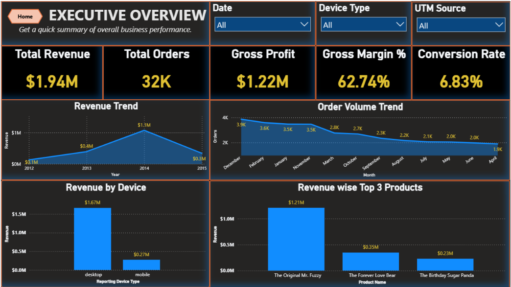
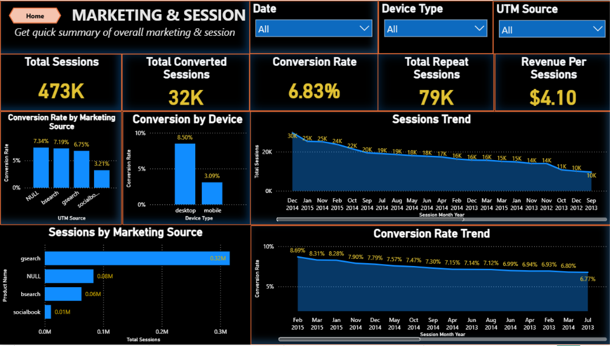
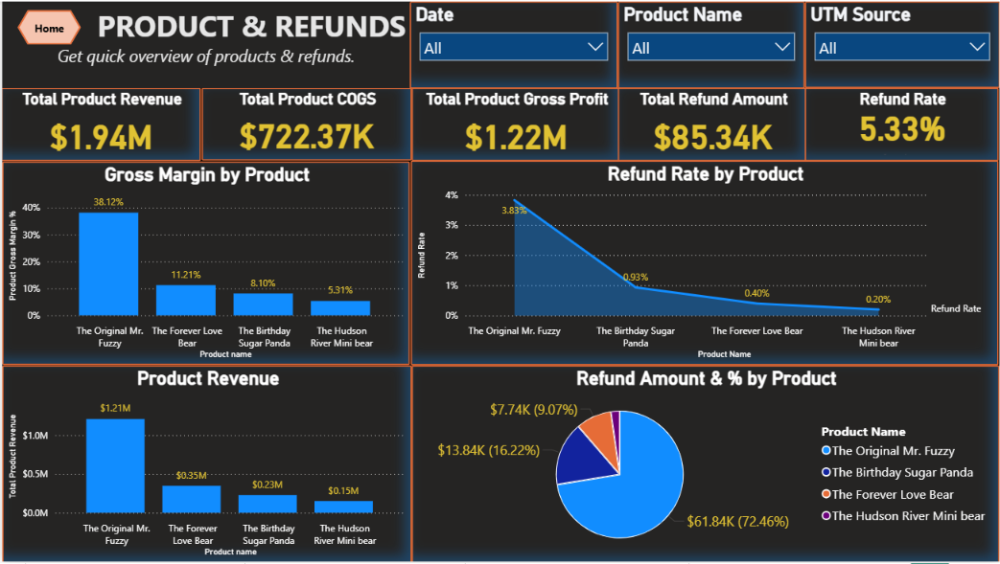
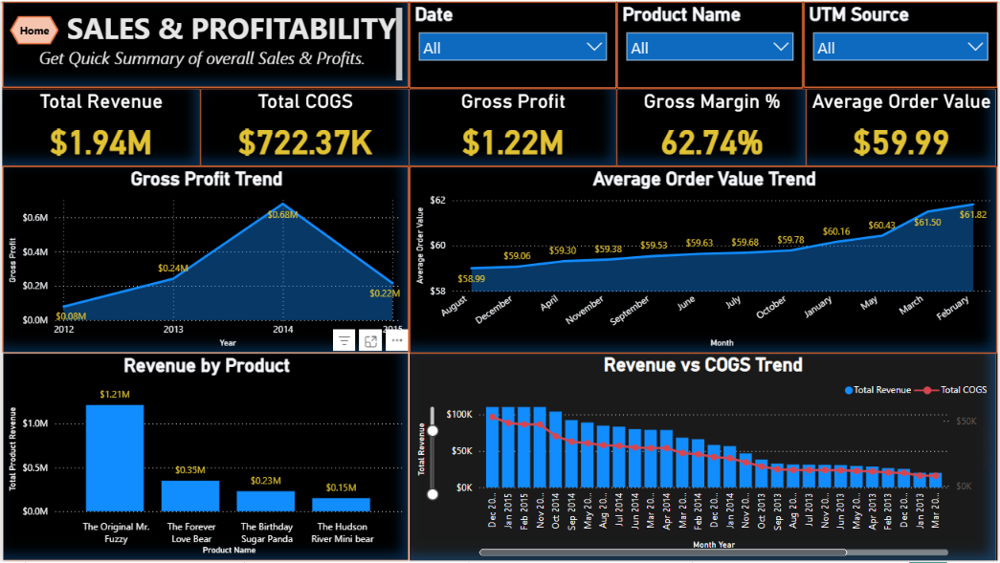

# PRP Digital Analytics — E-Commerce Product Analytics & Conversion Prediction

End-to-end analytics project on a stuffed-animal-toy e-commerce business: SQL Server data cleaning and auditing, descriptive and diagnostic EDA, four Power BI dashboards, and a first-pass Logistic Regression conversion model.

**Author:** Shubham Vishwakarma
**Stack:** SQL Server · Power BI · Python (Pandas, Scikit-learn) · Jupyter

---

## 1. Business Problem

The business lacks a unified, data-backed view of its own performance — leadership cannot easily see which marketing channels, devices, and products drive profitable growth, or where revenue is being lost to refunds and weak conversion.

## 2. Objective

- Build a clean, reproducible SQL analytical layer from the raw six-table schema
- Answer descriptive ("what happened") and diagnostic ("why") business questions
- Predict which website sessions are likely to convert
- Deliver Power BI dashboards for ongoing, self-serve monitoring
- Translate findings into prioritized business recommendations

## 3. Headline Results

| Metric | Value |
|---|---|
| Gross Revenue | $1.94M |
| Net Revenue | $1.85M |
| Total Orders | 32,313 |
| Total Sessions | 472,871 |
| Conversion Rate | 6.83% |
| Average Order Value | $59.99 |
| Gross Margin | 62.74% |
| Refund % of Revenue | 4.40% |

Full numbers: [`03_Python_Analysis_ML/outputs/business_summary.csv`](03_Python_Analysis_ML/outputs/business_summary.csv)

## 4. Repository Structure

```
shubham_datafocus_gmail_com/
├── 01_SQL_Codes/
│   ├── FINAL_SQL_MASTER.sql                     # entry point — run this first
│   ├── 01_Final_Audit_Revalidation.sql          # data-quality audit (read-only)
│   ├── 02_Data_Cleaning_and_Transformation.sql  # builds the analytics.vw_* views
│   ├── 03_KPI_Definitions.sql
│   ├── 04_EDA_Executive_Sales.sql
│   ├── 05_EDA_Website_Marketing.sql
│   ├── 06_EDA_Product_Refund.sql
│   ├── 07_EDA_Customer.sql
│   ├── 08_Diagnostic_Analysis.sql
│   ├── 09_Final_Data_Quality_Reconciliation.sql
│   ├── 10_Final_KPI_Snapshot.sql
│   └── ER-Diagram.png
├── 02_PowerBI_Dashboard/
│   ├── PRP_Ecommerce_Digital_Analytics_Dashboard.pbix
│   └── Power BI Dashboards.pdf                  # static export, no Power BI needed to view
├── 03_Python_Analysis_ML/
│   ├── ECommerce_Analytics_Python_ML_Analysis.ipynb
│   ├── conversion_prediction_model.pkl
│   └── outputs/                                 # business_summary, product_analysis, etc.
├── 04_Presentation/
│   ├── PRP_Ecommerce_Digital_Analytics_Final_Presentation.pptx
│   └── PRP_Ecommerce_Digital_Analytics_Final_Presentation.pdf
├── data/                                        # raw source CSVs (see §7 — not committed by default)
├── screenshots/                                 # dashboard images used below
├── requirements.txt
├── .gitignore
├── LICENSE
└── README.md
```

## 5. Data Model

Six source tables: `products`, `website_sessions`, `website_pageviews`, `orders`, `order_items`, `order_item_refunds`.



## 6. Dashboards

| Executive Overview | Marketing & Sessions |
|---|---|
|  |  |

| Product & Refunds | Sales & Profitability |
|---|---|
|  |  |

**Live Power BI link:** _add your published/shared workspace link here before submitting_

## 7. Data

The `data/` folder holds the six raw CSVs used to populate SQL Server (`products.csv`, `website_sessions.csv`, `website_pageviews.csv`, `orders.csv`, `order_items.csv`, `order_item_refunds.csv`).

`website_sessions.csv` (~41 MB) and `website_pageviews.csv` (~55 MB) are large. GitHub blocks any single file over 100 MB and warns above 50 MB, so by default this repo's `.gitignore` excludes the `data/` folder to keep the repo fast to clone. Choose one:

- **Recommended:** upload `data/` to Google Drive and add the link here: `<paste Google Drive folder link>`
- **Or:** track large files with [Git LFS](https://git-lfs.github.com) — `git lfs track "data/*.csv"` — then remove the `data/` line from `.gitignore` before committing

## 8. How to Run

### SQL Server
1. Create a database (default name used throughout: `PRP_Ecommerce_Analytics`).
2. Import the six CSVs from `data/` into matching `dbo.*` tables.
3. Run `01_SQL_Codes/FINAL_SQL_MASTER.sql` — it runs the audit, cleaning, and view-creation scripts in order.
4. Individual numbered scripts (`04`–`10`) can be run separately for specific EDA sections.

### Python / Jupyter
```bash
python -m venv venv
source venv/bin/activate        # Windows: venv\Scripts\activate
pip install -r requirements.txt
jupyter notebook "03_Python_Analysis_ML/ECommerce_Analytics_Python_ML_Analysis.ipynb"
```
The notebook connects to SQL Server via `pyodbc` (ODBC Driver 17). Update the `server` and `database` variables in the connection cell to match your local setup before running.

### Power BI
Open `02_PowerBI_Dashboard/PRP_Ecommerce_Digital_Analytics_Dashboard.pbix` in Power BI Desktop and point it at your own SQL Server instance, or just view `Power BI Dashboards.pdf` / the screenshots above — no Power BI install required.

## 9. Key Insights

- Revenue is concentrated: one product (**The Original Mr. Fuzzy**) drives 62% of total revenue
- Mobile under-converts badly: **3.09%** vs. **8.50%** on desktop, despite carrying 31% of sessions
- Direct/organic-leaning traffic (`NULL`, `bsearch`) converts better than paid `gsearch`
- Repeat visitors convert 18% better and spend 19% more per session than new visitors
- Refunds are concentrated in the highest-volume SKU, not a rate problem business-wide
- Session volume has declined since late 2014, dragging order volume down with it

## 10. Predictive Model — Honest Limitations

| Metric | Score |
|---|---|
| Accuracy | 93.17% |
| Precision | 0.00 |
| Recall | 0.00 |
| F1 Score | 0.00 |
| ROC-AUC | 0.632 |

93% accuracy looks strong, but precision/recall/F1 of 0 reveal the model predicts "no conversion" for nearly every session — a symptom of class imbalance (only 6.8% of sessions convert, so always predicting "no" already scores 93%). The 0.632 ROC-AUC confirms the features carry real signal; the model just isn't usable at the default 0.5 threshold yet.

**Next steps:** `class_weight='balanced'`, SMOTE oversampling, or a lowered decision threshold evaluated with a precision-recall curve instead of accuracy.

## 11. Recommendations

| Area | Recommendation | Expected Impact |
|---|---|---|
| Mobile experience | Audit and redesign the mobile checkout funnel | 3.09% → target 5%+ conversion |
| Traffic diversification | Invest in organic/repeat channels; reassess `gsearch` spend | Reduce single-source dependency |
| Product mix | Promote The Hudson River Mini Bear (best margin, lowest refunds) | Improve blended gross margin |
| Quality review | Investigate The Birthday Sugar Panda's 6.04% refund rate | Reduce refund leakage |
| Loyalty program | Formalize incentives for repeat visits | Grow repeat-session share |
| Model rework | Rebalance the conversion model before deployment | Usable precision/recall |

## 12. License

This project is shared under the [MIT License](LICENSE) — see the file for details.
